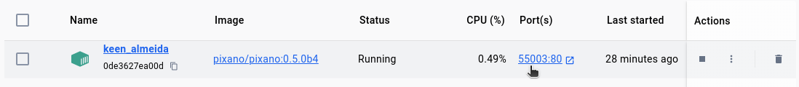

# Pixano Docker

Two options are available to pull (or build) and launch Pixano Docker Image:

- [Docker Desktop](https://www.docker.com/products/docker-desktop), available on Windows, Mac, Linux, for a more user-friendly experience.

- [Command line](#command-line) (this documentation cover optionnal build of Pixano Docker Image only with command line).


## Docker Desktop

### Pull Image

This only need to be done once, or each time you want to pull another version.

- Open Docker Desktop, tab "Images".
- Search image "pixano", look for line "pixano/pixano", select the desired tag (usually last available version) and press the "PULL" button


Pixano Docker image will be downloaded from DockerHub (~7Go).

### Run Image

- Open Docker Desktop.

Note: If you have already run a Pixano image, you can run the Pixano Container again from "Containers" tab. See [Container Run](#container-run).

For the first run, or if you want to change some settings:
 - go to "Images" tab.


- Press the run button.

In the popup, open the "Optional settings".


- Choose any available port in the Host port field, or 0 for a random available one.

- Select your [local library directory](#local-library-directory) in "Volumes" field "Host path", and enter "/library" (don't forget the '/') in the "Container path".

- Press "RUN".


- Click on the link provided here to open Pixano in your browser.


#### Container Run

Now, Pixano container can be stopped and run again with the same settings from "Container" tab.



## Command line

### Docker image Build

This is not required, as the run script will get Pixano docker image from DockerHub, if the desired Pixano image is not present on your system.

To build your own image with different versions of pixano and/or pixano-inference:

- Run the build script
```
./build.sh [<pixano_version>] [<pixano-inference_version>] [<tag>]
```

If you don't provide pixano version, pixano-inference version, and tag, defaults values specified in this script will be used.

| Arguments | Defaults |
|:---|:---|
| pixano_version | 0.5.0b4 |
| pixano-inference_version | v0.3.0b2 |
| tag | \<pixano_version> |

Give a *tag* if you want to overwrite the default (pixano_version)

#### Side-note on image weight

You can generate a light-weight Pixano docker image (~2Go) without importing pixano-inference, but semantic search won't be available then.
Comment or uncomment the following line in Dockerfile:

> RUN pip install pixano-inference@git+https://github.com/pixano/pixano-inference@$pixano_inference_version

With pixano-inference module, the image will be heavier (~12Go), because pixano-inference use some heavy libs (pytorch, tensorflow, transformers, ...).

### Docker image Run

- Run the pixano script with your [local library directory](#local-library-directory)
```
./pixano.sh <local_library_directory> [<tag>] [<port>]
```
If you don't provide pixano version and port, default values specified in this script will be used.
| Arguments | Defaults |
|:---|:---|
| tag | 0.5.0b4 |
| port | 80 |

Pixano Docker image will be pull from DockerHub if there is no local image build or previous image pull.

- Open your browser and go to provided link [http://0.0.0.0:80](http://0.0.0.0:80).

#### S3 Storage

Pixano allows connection to a S3 compatible storage.

*work in progress*

 TODO: runS3.sh

- Add AWS relevent environment vars in Dockerfile (for credentials, use docker "secret" (need to read about this))
- Add MODEL_DIR environment variable in Dockerfile (ENV MODEL_DIR=library/models)
- change CMD line "library" to "s3://*your_bucket*"

## Local library directory

This is the directory from where Pixano will read your datasets

Plese note that running Pixano as a Docker image is not well-suited for importing and exporting datasets, as it use Pixano python package.
To import and export datasets, it's recommanded to use "pip install" (see [Installing Pixano](https://github.com/pixano/pixano?tab=readme-ov-file#installing-pixano))

Refer to [Import datasets Notebook](https://github.com/pixano/pixano/blob/main/notebooks/datasets/import_dataset.ipynb) for instructions on how to import datasets to Pixano format.

### Interactive Segmentation Model

Your local library directory must contains a "models" directory with .onnx model(s) weights for interactive segmentation to work.

Refer to [Interactive annotation Notebook](https://github.com/pixano/pixano/blob/develop/notebooks/models/interactive_annotation.ipynb) for instructions on how to generate the .onnx model file for interactive segmentation.

