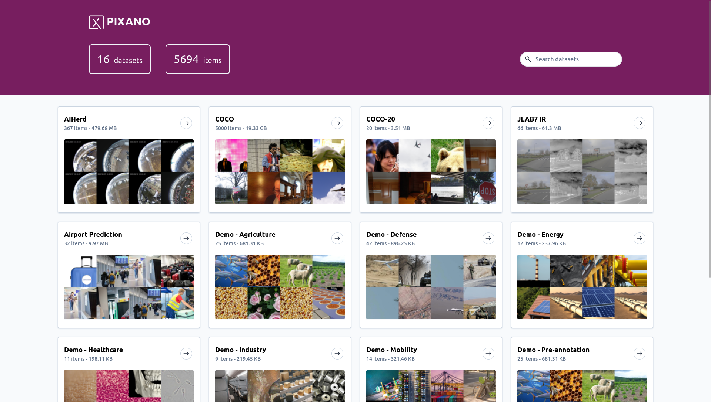
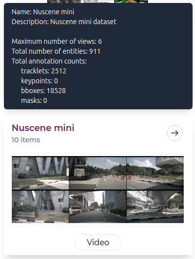
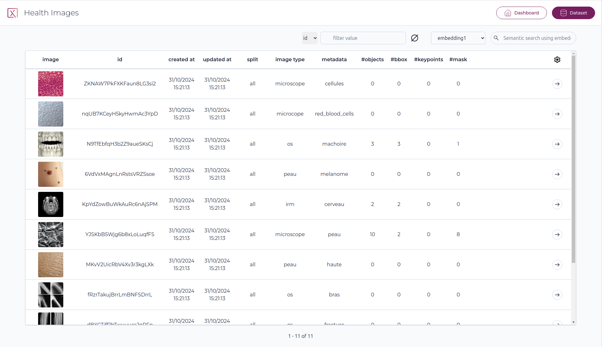
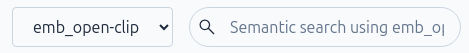
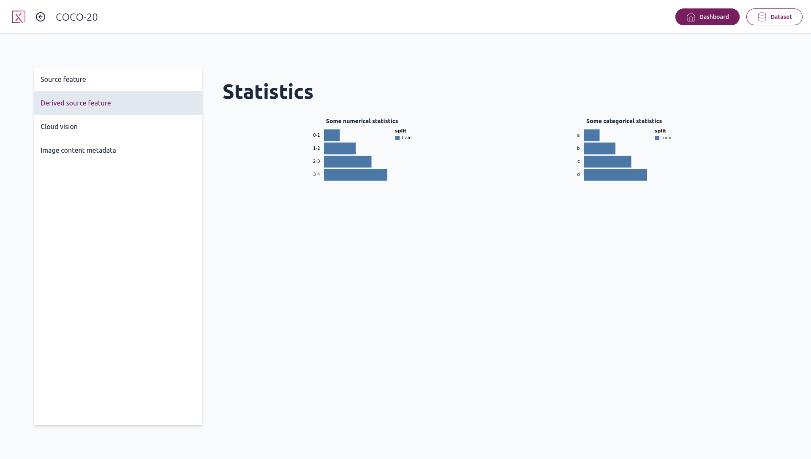
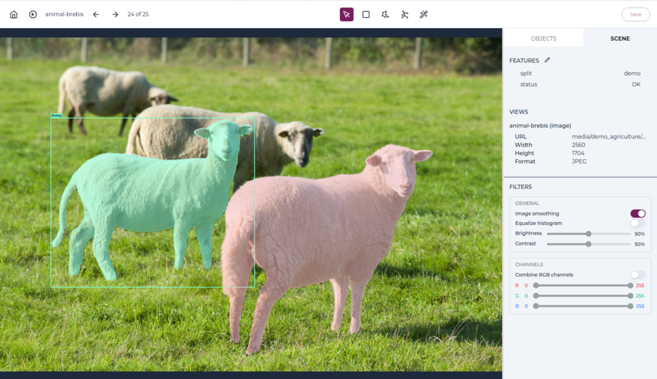
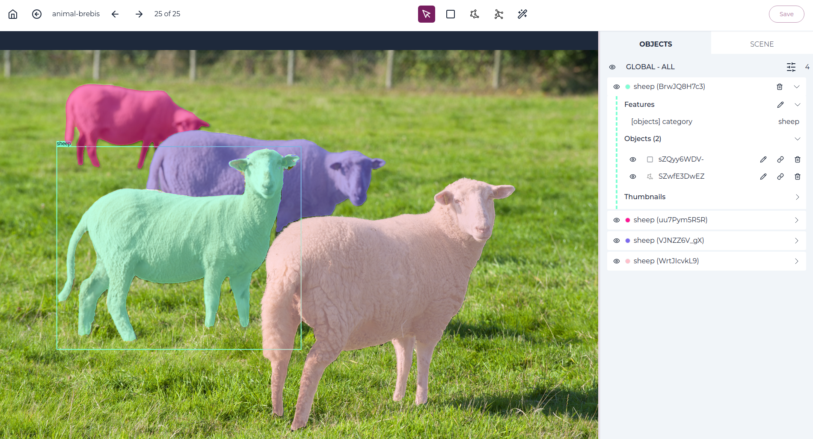
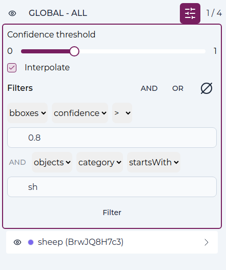
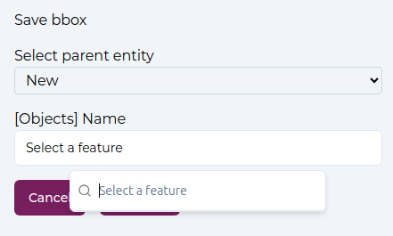
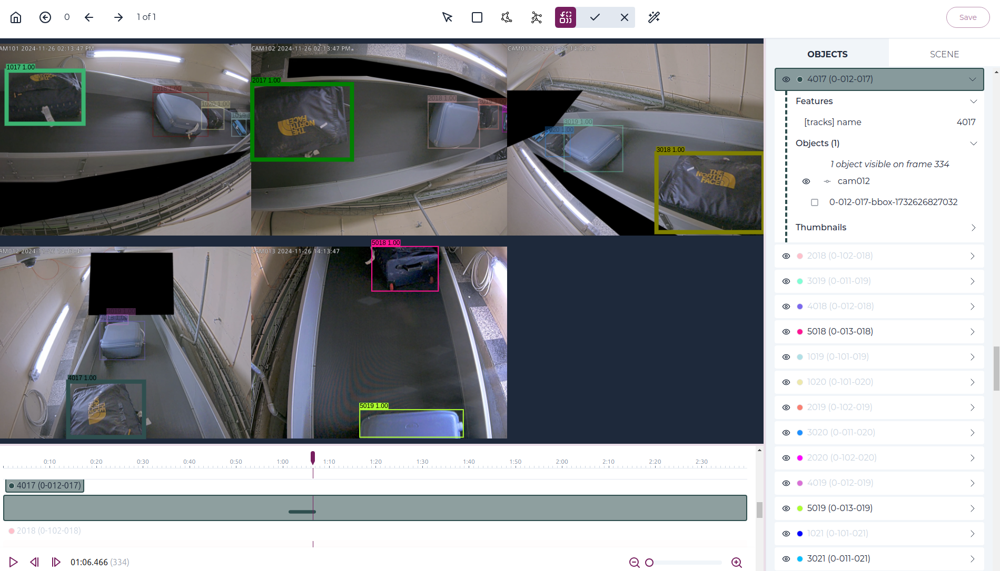

# Using Pixano

## Home page

From the app home page, you will be greeted with a list of all the Pixano format datasets found in the directory you provided.

### Header

On the header is displayed the number of datasets and total number of items in datasets. A field allows to filter datasets by contained text.

### Dataset Card

Each dataset card display dataset name, number of items, an image (currently user-defined), and the dataset kind (Image, Video, VQA or EntityLinking), if defined.

When hovering over a dataset card, a tooltip will display this dataset specific information: name, description, maximum number of views, total number of entities, as well as a count of each different annotations.

Clicking on a dataset card will lead to the selected dataset page.

## Dataset page

On the dataset page, you will see a list of all the items it contains, by pages of 20 items.

### Header

On the header is displayed the dataset name. Pixano logo allows to go back to Pixano home page. "Dashboard" and "Dataset" buttons allows to switch between Dashboard and Dataset view. Datasets are always open in "Dataset" mode first.

### Column filter

You can filter table by choosing a column and a value. the right button clear the filter.

Note: "Free mode" allows to type your filter, as a basic SQL WHERE clause. Only listed columns are availables. Strings must be enclosed in single quotes in free mode.

Free mode example: `id LIKE '%009' AND split = 'train2017'` will filter rows where id ends with 009 and split equals 'train2017'.

<!-- devnote: the filter is not persistent -- this must be fixed! -->

### Semantic search

If you have [computed semantic embeddings](../tutorials/semantic_search.md), semantic search will be displayed.
You can select semantic embeddings (stored in a table) and type some text to get your dataset items sorted by semantic distance to this text (closer first).

### Item table

Table header display columns name. By default, the "images" columns are first, then dataset items metadatas, then computed counts columns (with a leading '#'). Except images columns, you can order items of any column, ascending or descending, by clicking on it.

This ordering is disabled after a semantic search.

The "gear" icon open a panel to select which columns to display, and reorder them. By default all available columns are displayed.

<!-- devnote: "gear" settings are not persistent -- should be corrected? -->

### Navigation

Navigation buttons at bottom allows to move through the pages of your dataset.

Clicking on any item lead to Item page.

<!-- devnote: for big datasets, the ability to enter a page number may be usefull -->

## Dashboard page

From the dataset page, you can go to the dashboard page, which contains more information about your datasets and also displays all the computed statistics available.

<!-- devnote: need rework or more dev... -->

## Item page

When opening an item, the item media will be displayed in the center on the screen. For multi-view datasets, the images will be tiled.

On the right, a two-tab panel, Object or Scene, is displayed.

For video datasets, there will be a timeline display of tracks.

For VQA and EntityLinking datasets, ther will be a text panel on the left.

You can resize panels by dragging the thin border pink line between them.

### Header

The "Home" icon return to home page.

The circled left arrow go back to dataset explorer page, at the current item's page.

Dataset item id is displayed next.

Left and right arrows allows to go to previous/next item, in the current selection and order. Shortcuts, detailed in tooltip, are available too.

Next, is displayed the index of current item in the full selection, ordered.

The [toolbar](#toolbar) is at the center.

"Save" button on the right. It has a pulsing dot when there is changes to save.

### Scene panel

The scene panel will display all the scene features, like the item split, or any other feature created when importing your dataset, as well as metadata information on all the images in the item.

You can edit the scene features and then click the save changes button to write them to the dataset.

There is also a set of image filters and settings. They allow to disable / enable image smoothing, equalize the image histogram, and tune brightness, contrast, or RGB channels.

### Object panel

The objects panel will display all the item objects.

On the header line just under tabs, a global visibility icon can hide/show all objects. On the right, an "options" icon, and the number of objects is displayed. If some filter apply, this the number of filtered object / total number of objects.

#### Options

By clicking on "Options" icon, the option panel opens.

Here you can set a threshold for bounding boxes confidence.

In video mode, disable / enable interpolation of bounding boxes and keypoints.

Filters are available. You can add new filter wit 'AND" or "OR" buttons, and clear the filters with the "clear" icon.
For each filter, you have to select a table, a field, an operator, and a value.
Note that "AND" has precedence over "OR".
Click on "Filter" button to apply.

#### Object item

For each object in the dataset item, an object card is displayed.

An "Eye" icon allows to toggle visibility.

A "Trash" icon, when opened or on hover, allows to delete the object. It requires another click within 3 seconds to confirm.

The right most "chevron" icon open the details.

When opened, there is at most 4 sub-sections: Features, Objects, Thumbnails and Text spans. Some are displayed only if relevant.

- "Features" display the object features. Clicking on the "Edit" icon allows to edit them.
  Each features is displayed with it's table name in brackets (in some cases features are from different sub-objects).

- "Object" display the sub-objects, somehow the shapes belonging to that object, or entity.
  For video, there can be another layer as shapes are under tracklets.

For each sub object, here also an "Eye" icon to toggle visibility, then an icon that represent the kind of sub-object (bounding box, mask, keypoints, text, or tracklet). Hovering on it show the actual class. Next is it's id.
On the right, an "Edit" icon, if relevant, allows to modify the shape. A "Link" icon allows to relink this shape in another object (entity). And finally a "Trash" icon to delete it.

- "Thumbnails" shows a crop of the object, if relevant. Note: It is not meant to be the exact bounding box, if any, but as a quick look on the object.

- "Text spans" is only for EntityLinking datasets, and show a table associating text span features to the actual text span (the highlighted text).

### Toolbar

<!-- TMP Where?-- Also, is you want to select image or an object under another object, you can select the front one and hide it with visibility icon on right panel. Then you can go through the hidden one.
-->

#### Pan tool

With the pan tool selected, you can move the image around. This is especially useful for multi-view datasets for organizing multiple images.

Moving the images is still possible while any other tools is selected by using your mouse middle click. You can also zoom in and out of an image with the mouse wheel, and double click an image to bring it in front of the others.

#### Creation tools

Each of theses tools allows creation of a new shape.

There is 3 manual creation tools, and the interactive segmentation tool.

For each tool, when the shape is drawn, you will be prompted to enter values for your object features depending on your dataset, and to confirm the object.

The dropbox "Select parent Entity" let choose if the object is a new object, or if it belongs to an existing one.

Below, each relevant feature for this shape is listed, with an input to enter value. If Features Values <!--TODO link to FeaturesValues (future) doc--> are defined, choices may be proposed.

##### Bounding box tool

With the bounding box tool, you can create a bounding box object by click and dragging a rectangle over the image.

##### Polygon tool

With the polygon tool, you can create a segmentation mask manually by adding points with the granularity of your choice.

##### Keypoints tool

With the keypoints tool, you can create a keypoints.
First select one of the keypoints templates, then drag a box to roughly place the template. Now you can place each keypoint by dragging them.

Once created, by editing keypoints shape, you can change a keypoint status (visible, hidden, invisible) by clicking on it.

##### Smart segmentation tool

With Pixano, you can segment with smart segmentation tool like SAM (Segment Anything Model).

The first time you click on the "magicwand" icon, the Smart Model Selection modal will open, to configure the segmentation model to use. See more information on [Smart Model Selection](#TODO).

With the positive and negative points, you can inform the interactive segmentation tool on which part of the image you are trying to segment, and it will generate the mask.

When relevant, you can also use the rectangle tool to select the thing you want to segment.

#### Associate tool

In video mode only, a "associate" icon allows to merge tracks.

In this mode, select a first object in any view, then other objects to associate. Clicking again on a object deselect it.
Object that cannot be selected, because of current selection, are greyed out.
You can move in the timeline, select in other view or other kind of shapes.
Validate when done. All selected objects are merged in the first one of the selected list.
