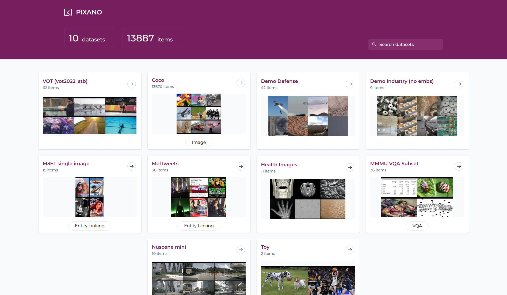
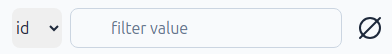

# Using Pixano

## Home page

From the app home page, you will be greeted with a list of all the Pixano format datasets found in the directory you provided.

### Header

On the header is displayed the number of datasets and total number of items in datasets. A field allows to filter datasets by contained text.

### Dataset Card

Each dataset card display dataset name, number of items, an image (currently user-defined), and the dataset kind (Image, Video, VQA or EntityLinking), if defined.

When hovering over a dataset card, a tooltip will display this dataset specific information: name, description, maximum number of views, total number of entities, as well as a count of each different annotations.

Clicking on a dataset card will lead to the selected dataset page.

## Dataset page

On the dataset page, you will see a list of all the items it contains, by pages of 20 items.

### Header

On the header is displayed the dataset name. Pixano logo allows to go back to Pixano home page. "Dashboard" and "Dataset" buttons allows to switch between Dashboard and Dataset view. Datasets are always open in "Dataset" mode first.

### Column filter

You can filter table by choosing a column and a value. the right button clear the filter.

Note: "Free mode" allows to type your filter, as a basic SQL WHERE clause. Only listed columns are availables. Strings must be enclosed in single quotes in free mode.

Free mode example: `id LIKE '%009' AND split = 'train2017'` will filter rows where id ends with 009 and split equals 'train2017'.

<!-- devnote: the filter is not persistent -- this must be fixed! -->

### Semantic search

If you have [computed semantic embeddings](../tutorials/semantic_search.md), semantic search will be displayed.
You can select semantic data (stored in a table) and type some text to get your dataset items sorted by semantic distance to this text (closer first).

### Item table

Table header display columns name. By default, the "images" columns are first, then dataset items metadatas, then computed counts columns (with a leading '#'). Except images columns, you can order items of any column, ascending or descending, by clicking on it.

This ordering is disabled after a semantic search.

The "gear" icon open a panel to select which columns to display, and reorder them. By default all available columns are displayed.

<!-- devnote: "gear" settings are not persistent -- should be corrected? -->

### Navigation

Navigation buttons at bottom allows to move through the pages of your dataset.

Clicking on any item lead to Item page.

<!-- devnote: for big datasets, the ability to enter a page number may be usefull -->

## Dashboard page

From the dataset page, you can go to the dashboard page, which contains more information about your datasets and also displays all the computed statistics available.

<!-- devnote: need rework or more dev... -->

## Item page

When opening an item, the item media will be displayed in the center on the screen. For multi-view datasets, the images will be tiled.

On the right, a two-tab panel, Object or Scene, is displayed.

For video datasets, there will be a timeline display of tracks.

For VQA and EntityLinking datasets, ther will be a text panel on the left.

You can resize panels by dragging the thin border pink line between them.

### Header

The "Home" icon retunr to home page.

The circled left arrow go back to dataset explorer page, at the current item's page.

Dataset item ID is displayed next.

Left and right arrows allows to go to previous/next item, in the current selection and order.

Next, is displayed the index of current item in the full selection, ordered.

The toolbar is at the center.

"Save" button on the right. It has a pulsing dot when there is changes to save.

#### Toolbar

The "mouse" icon is the Pan/Select tool. In this mode you can select any object in the view.
By dragging image, outside of an object area, you can move the image (may be usefull in multiview or if zoomed)

You can always zoom in or out with the mouse wheel, as well as move image with wheel button, even outside of Pan tool.

Also, is you want to select image or an object under another object, you can select the front one and hide it with visibility icon on right panel. Then you can go through the hidden one.

Next are tools to draw bounding box, polygon, and keypoints.

In video mode, a "associate" icon allows to merge tracks.

The "magic wand" icon give access to interactive segmentation.

### Scene panel

The scene panel will display all the scene features, like the item split, or any other feature created when importing your dataset, as well as metadata information on all the images in the item.

You can edit the scene features and then click the save changes button to write them to the dataset.

There is also a selection of image filters and settings. They allows to disable / enable image smoothing, equalize the image histogram, tune brightness / contrast, or RGB channels.

### Object panel

The objects panel will display all the item objects.

You have visibility toggles for objects and object group, and when hovering on an object, you will have access to an edit tool and a delete tool.

<!--If you have used an inference model for pre-annotating the dataset, a "Pre-annotation" toggle will also appear above the ground truth section. Activating this toggle will let you go through each object and accept or reject them individually. You will also be able to edit the object features before accepting it.-->

The edit tool will allow you to edit the object features, for example its category and category ID.
and also allow you to edit the object bounding box and mask on the image. For text features, auto-completion based on existing feature values in the dataset is available.

To create new objects, you have multiple tools at your disposal on the top toolbar.

### Toolbar

#### Pan tool

With the pan tool selected, you can move the image around. This is especially useful for multi-view datasets for organizing multiple images.

Moving the images is still possible while any other tools is selected by using your mouse middle click. You can also zoom in and out of an image with the mouse wheel, and double click an image to bring it in front of the others.

#### Bounding box tool

With the bounding box tool, you can create a bounding box object by click and dragging a rectangle over the image. Once you are done with your selection, you will be prompted to enter values for your object features depending on your dataset (in this case category_id and category), and to confirm the object.

Then, click save changes in the object panels to save the created object to your dataset.

#### Polygon tool

With the polygon tool, you can create a segmentation mask manually by adding points with the granularity of your choice.

Once you save this mask, a matching bounding box will automatically be created.

#### Smart segmentation tool

With Pixano, you can segment with smart segmentation tool like SAM (Segment Anything Model). Please follow our documentation on how to precompute the embeddings required by SAM and export its ONNX model to be able to use it.

With the positive and negative points, you can inform SAM on which part of the image you are trying to segment, and SAM will generate the mask for you.

When relevant, you can also use the rectangle tool to select the thing you want SAM to segment.

When saving the mask created by SAM, like with the polygon tool, a matching bounding box will automatically be created.
