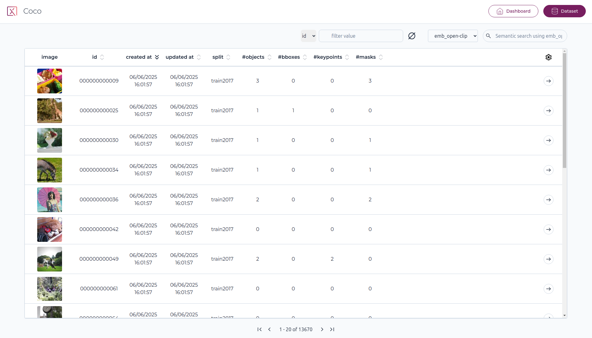

# Using Pixano

## Home page

From the app home page, you will be greeted with a list of all the Pixano format datasets found in the directory you provided.

On this page header is displayed number of datasets and total number of items in datasets. A field allow to filter datasets by contained text.

Each dataset card display dataset name, number of items, an image (currently user-defined), and the dataset kind (Image, Video, VQA or EntityLinking), if defined.

When hovering over a dataset card, a tooltip will display this dataset specific information: name, description, maximum number of views, total number of entities, as well as a count of each different annotations.

Clicking on a dataset card will lead to this dataset page.

## Dataset page

On the dataset page, you will see a list of all the items it contains, organized in pages.

Navigation buttons at bottom allows to move through the pages of your dataset.

## Dashboard page

From the dataset page, you can go to the dashboard page, which contains more information about your datasets and also displays all the computed statistics available.

## Item page

When opening an item, the item media will be displayed in the center on the screen (in case of multi-view datasets, the images will be tiled).

On the top, a toolbar is available. On the right, two panels will display information on the item objects and scene.

For video datasets, there will be a timeline display of tracks.

For VQA and EntityLinking datasets, ther will be a text panel on the left.

### Scene panel

The scene panel will display all the scene features, like the item label, or any other feature created when importing your dataset, as well as metadata information on all the images in the item.

You can edit the scene features and then click the save changes button to write them to the dataset.

### Object panel

The objects panel will display all the item objects.

You have visibility toggles for objects and object group, and when hovering on an object, you will have access to an edit tool and a delete tool.

<!--If you have used an inference model for pre-annotating the dataset, a "Pre-annotation" toggle will also appear above the ground truth section. Activating this toggle will let you go through each object and accept or reject them individually. You will also be able to edit the object features before accepting it.-->

The edit tool will allow you to edit the object features, for example its category and category ID.
and also allow you to edit the object bounding box and mask on the image. For text features, auto-completion based on existing feature values in the dataset is available.

To create new objects, you have multiple tools at your disposal on the top toolbar.

### Toolbar

#### Pan tool

With the pan tool selected, you can move the image around. This is especially useful for multi-view datasets for organizing multiple images.

Moving the images is still possible while any other tools is selected by using your mouse middle click. You can also zoom in and out of an image with the mouse wheel, and double click an image to bring it in front of the others.

#### Bounding box tool

With the bounding box tool, you can create a bounding box object by click and dragging a rectangle over the image. Once you are done with your selection, you will be prompted to enter values for your object features depending on your dataset (in this case category_id and category), and to confirm the object.

Then, click save changes in the object panels to save the created object to your dataset.

#### Polygon tool

With the polygon tool, you can create a segmentation mask manually by adding points with the granularity of your choice.

Once you save this mask, a matching bounding box will automatically be created.

#### Smart segmentation tool

With Pixano, you can segment with smart segmentation tool like SAM (Segment Anything Model). Please follow our documentation on how to precompute the embeddings required by SAM and export its ONNX model to be able to use it.

With the positive and negative points, you can inform SAM on which part of the image you are trying to segment, and SAM will generate the mask for you.

When relevant, you can also use the rectangle tool to select the thing you want SAM to segment.

When saving the mask created by SAM, like with the polygon tool, a matching bounding box will automatically be created.
