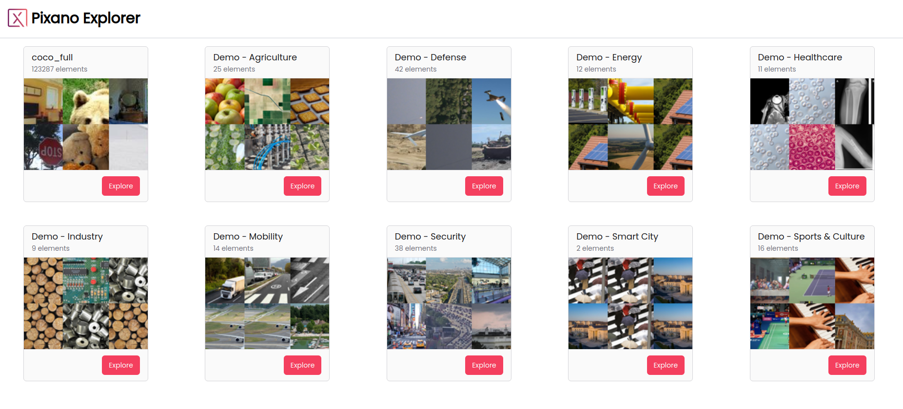
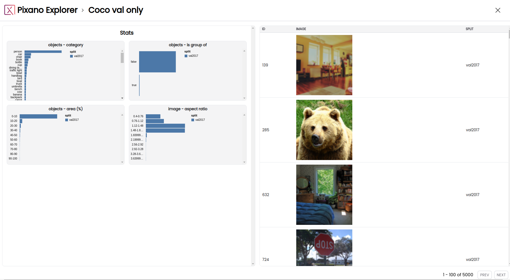
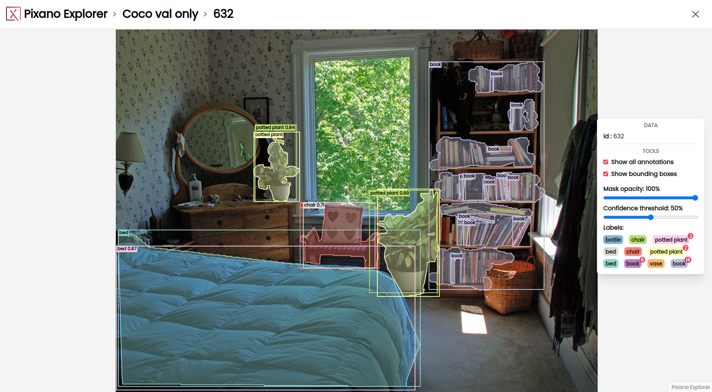

# Using Pixano Explorer

## Home page

From the Explorer home page, you will be greeted with a list of all the datasets in Pixano format found in the directory you provided.

For each dataset, you can see its name, the number of elements inside it, and a thumbnail composed from six sample elements.

You can hover over a dataset name to check the dataset description if it has one.

You can click on a dataset to open its exploration page.

## Exploration page

### Statistics

Available statistics will be displayed on the left side of the dataset page.

You can hover over different elements in the statistics to get more detailed information.

_Filtering your dataset based on the selected statistics will soon be available._

### Elements list

The dataset elements will be displayed on the right side of the dataset page.

Elements are displayed in scrollable pages of up to 100 elements.

You can navigate between pages with the _Previous_ and _Next_ buttons at the bottom.

You can click on any element to open it in the exploration page.

For each element, you can see columns for its ID, a thumbnail for each of its media, and the dataset split it comes from.

_Filtering your dataset based on these columns will soon be available._

### Going home

To go back to the home page, click on "Pixano Explorer" in the top left-hand corner or on the _Close_ icon in the top right-hand corner.

## Element view page

### Element view

The selected element (image or images for multi-view datasets) is displayed.

You can zoom in and out with the mouse wheel.

You can grab and move images on the canvas.

You can double click on an image to move it above other images with a multi-view dataset.

Annotations, in form of segmentation masks and bounding boxes, are displayed.
Each object category is given a color.

On each bounding box, the object category is displayed in the top left-hand corner, together with the confidence score if the bounding box was obtained by the inference of a given model.

### Right toolbar

A _toolbar_ is available on the right side of the page with the following sections:

- A **_Data_** section to display information on the element, like its ID

- A **_Tools_** section to filter the annotations
  - The _Show all annotations_ checkbox allows you to toggle annotations visibility
  - The _Show bounding boxes_ checkbox allows you to toggle bounding box visibility
  - The _Mask opacity_ slider allows you to adjust the opacity of segmentation masks
  - The _Confidence threshold_ slider allows you to adjust the threshold to filter the inferred boxes to display
  - The _Labels_ list allows you to see the number of annotations for any label, and to toggle annotations visibility for individual labels by clicking on their names

_More options to display ground truths and inference annotations separately and with different colors will be coming soon._

_More options for multi-view datasets will be coming soon._

### Going home

To go back to the home page, click on "Pixano Explorer" in the top left-hand corner.

To go back to the exploration page, click on the dataset name in the top left-hand corner or on the _Close_ icon in the top right-hand corner, or press the _Esc_ key.
